# 📹 Live View Player — WebRTC & HLS 雙協議影像播放系統

> 雲端影像管理平台的核心播放模組，支援 WebRTC 即時串流與 HLS 點播，具備多通道播放、數位縮放、截圖、錄影等完整功能。

---

## 🧭 系統架構總覽

整體架構分為四層：主要元件層、播放器層、影片控制層、Hook 層。

```
LiveView
  └── LayoutViewBox        # 多格影片容器（支援拖曳排序）
        └── LayoutView     # 單一影片格，依 connectType 選擇播放器
              ├── CeresPlayer   ──→ HLS Stream
              └── WebrtcPlayer  ──→ WebRTC Stream
                    └── TutkVideo          # 核心播放元件
                          ├── useVideo     # 播放控制
                          ├── useZoom      # 縮放 / 拖曳
                          ├── useCapture   # 截圖 / 縮圖上傳
                          └── useCanvasRecord  # Canvas 錄影
```

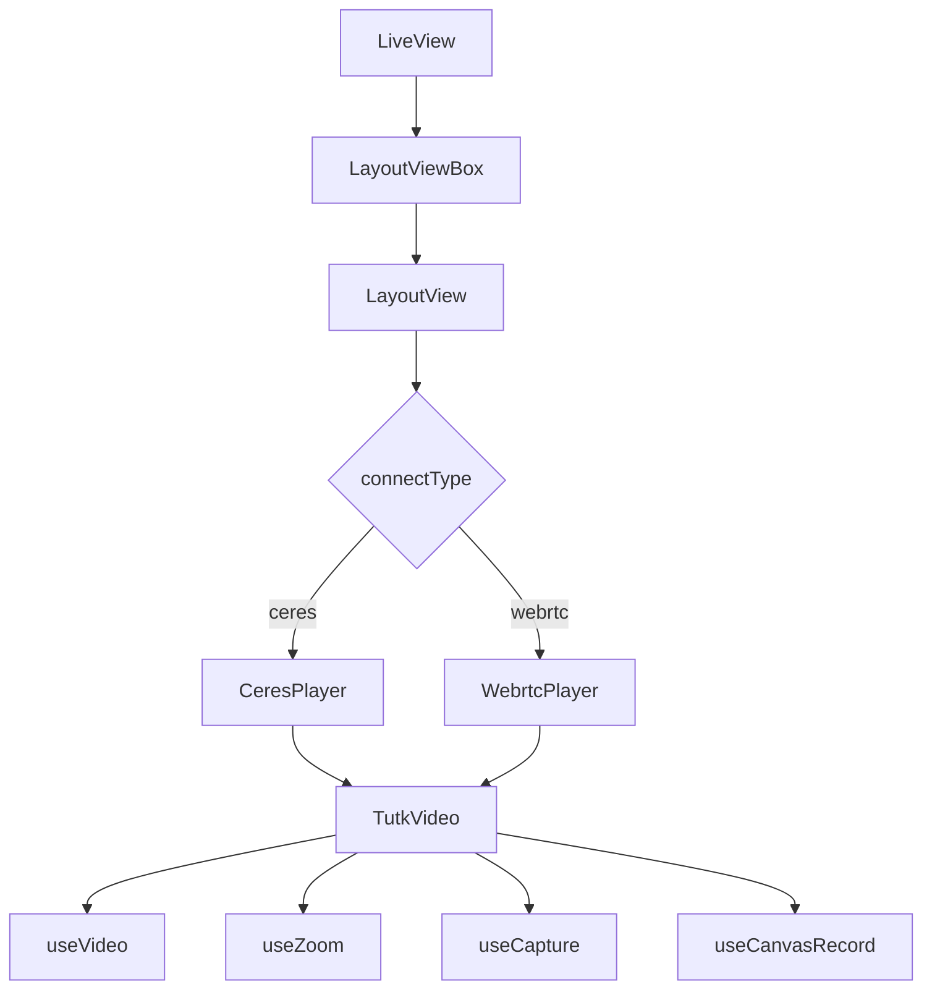

---

## 🔀 播放器選擇策略

| connectType | 播放器 | 串流協議 | 適用場景 |
|-------------|--------|----------|----------|
| `ceres` | CeresPlayer | HLS (hls.js) | 穩定錄播、低延遲需求較低 |
| `webrtc` | WebrtcPlayer | WebRTC | 即時監控、雙向語音 |

`connectType` 由設備屬性決定，在裝置初始化時由後端回傳，前端根據此值動態載入對應播放器。

---

## 🎬 核心流程

### 初始化流程

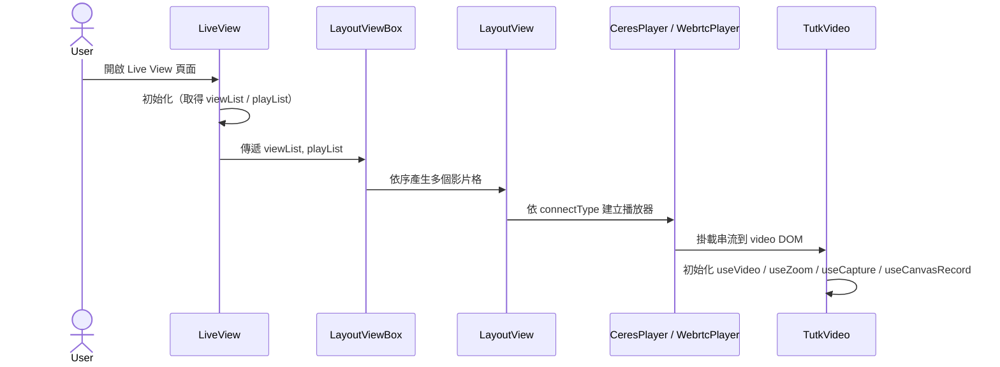

### 影片播放狀態機

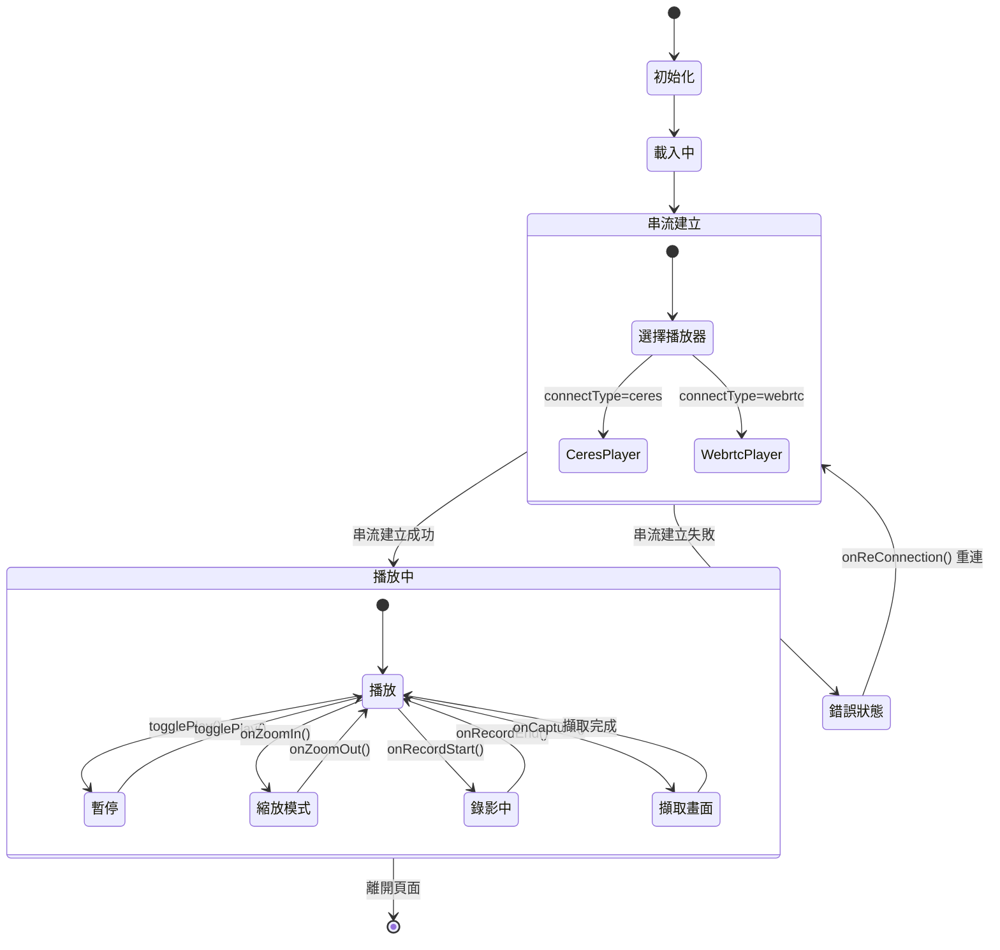

---

## 🧩 元件說明

### TutkVideo — 核心播放元件

包裝 HTML `<video>` 標籤，整合所有播放控制功能，同時支援 HLS 與 WebRTC 兩種模式。

**主要功能：**

| 功能 | 說明 |
|------|------|
| 播放 / 暫停 | 透過 `useVideo` 管理播放狀態 |
| 數位縮放 | 透過 `useZoom` 實現放大縮小與拖曳 |
| 截圖 | 透過 `useCapture` 擷取當前畫面 |
| 錄影 | 透過 `useCanvasRecord` 錄製成 mp4 / webm |
| PTZ 雲台控制 | 即時串流時支援鏡頭方向與焦距控制 |
| 全螢幕 | 支援進入 / 退出全螢幕 |
| 多裝置支援 | 桌面版 VideoControls / 行動版 MobileVideoControls |
| 閒置偵測 | `useActiveMouse` 自動暫停 / 恢復串流 |

---

## 🪝 Custom Hooks 說明

### `useVideo` — 播放控制

管理 video DOM 的播放、暫停、靜音、倍速、進度等所有互動狀態。

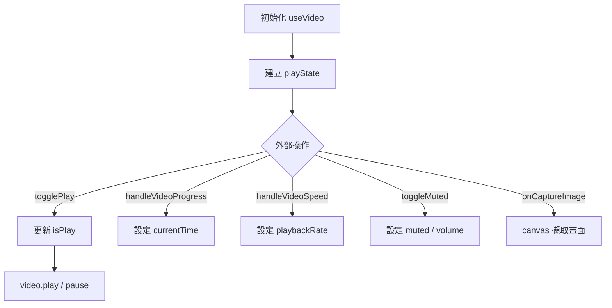

**輸出介面：**

```ts
{
  playState,            // 播放狀態（isPlay, isMuted, 進度, 音量, 倍速）
  togglePlay,           // 切換播放 / 暫停
  setPlay,              // 強制播放
  setStop,              // 強制暫停
  handleOnTimeUpdate,   // 進度更新事件
  handleVideoProgress,  // 拖曳進度條
  handleVideoSpeed,     // 改變播放速度
  toggleMuted,          // 切換靜音
  onCaptureImage,       // 擷取畫面
  currentTime,          // 目前播放秒數
  duration,             // 影片總長度
  isLoading             // 是否 loading 中
}
```

---

### `useZoom` — 數位縮放 / 光學縮放

支援數位縮放（CSS transform）與設備端光學縮放（API 控制鏡頭），並整合拖曳移動功能。

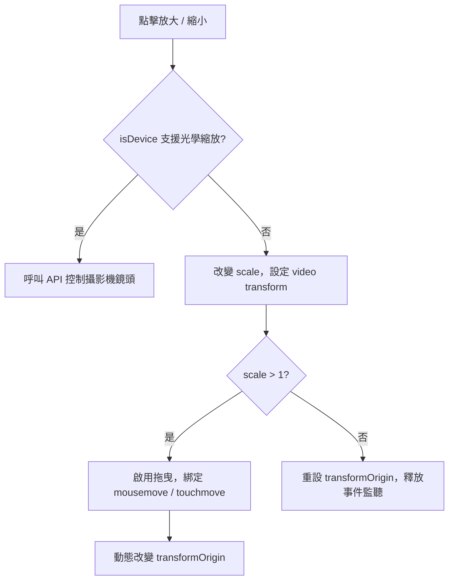

**輸出介面：**

```ts
{
  scale,          // 當前縮放比例
  setScale,       // 設定縮放比例
  onZoomInClick,  // 放大
  onZoomOutClick  // 縮小
}
```

---

### `useCapture` — 截圖 / 縮圖自動上傳

擷取 video 當前畫面為 base64 圖片，並在 Live 模式下自動定時上傳縮圖到伺服器。

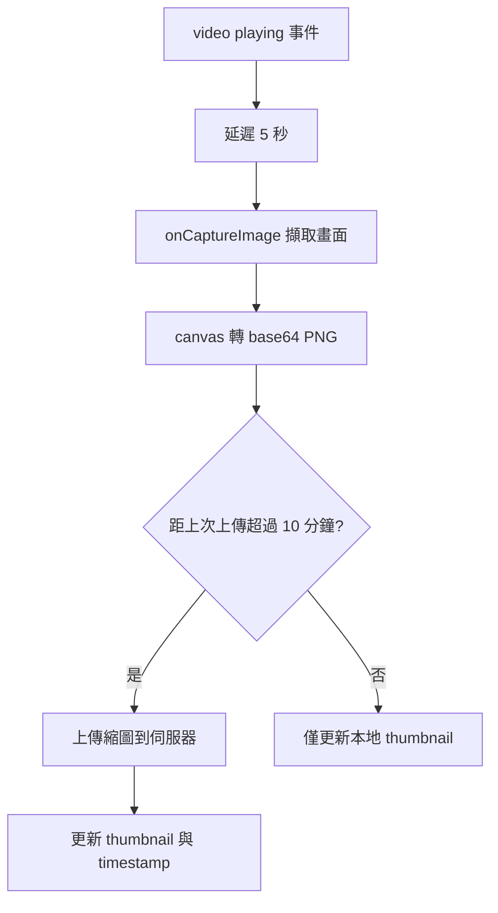

**輸出介面：**

```ts
{
  thumbnail,          // 當前縮圖 base64
  thumbnailUploadTs   // 上次上傳時間戳
}
```

---

### `useCanvasRecord` — Canvas 錄影（HLS 模式）

將 video 畫面繪製到 canvas 後，透過 `RecordRTC` 錄製成 webm / mp4 檔案。

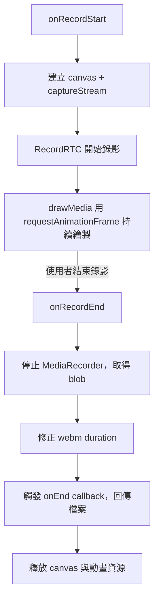

**輸出介面：**

```ts
{
  onRecordStart,  // 開始錄影
  onRecordEnd,    // 結束錄影
  isRecording,    // 是否錄影中
  recordStart     // 錄影開始時間（以 viewId 為 key）
}
```

---

### `useActiveMouse` — 閒置偵測

監控使用者操作行為，超過指定時間無操作時自動觸發暫停，有操作時自動恢復。

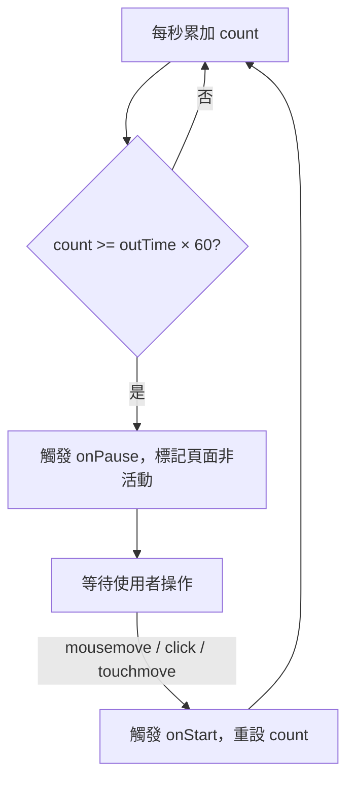

---

## 🗺️ 平面圖攝影機定位編輯器

VMS 系統的地圖管理模組，支援在 PDF 平面圖上配置攝影機位置與視角。

### 功能展示

**攝影機定位 — 一般檢視模式**

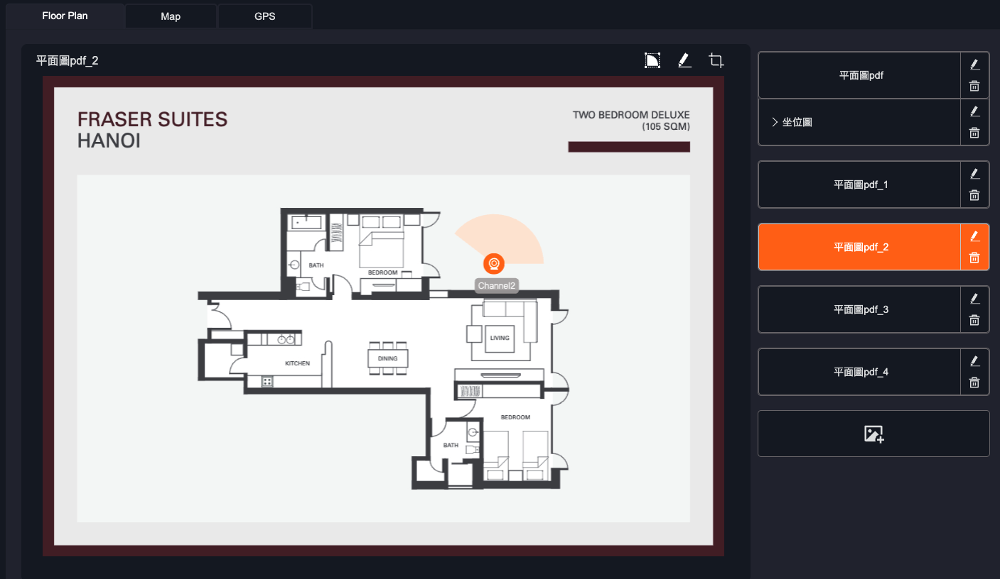

**攝影機視角編輯模式**

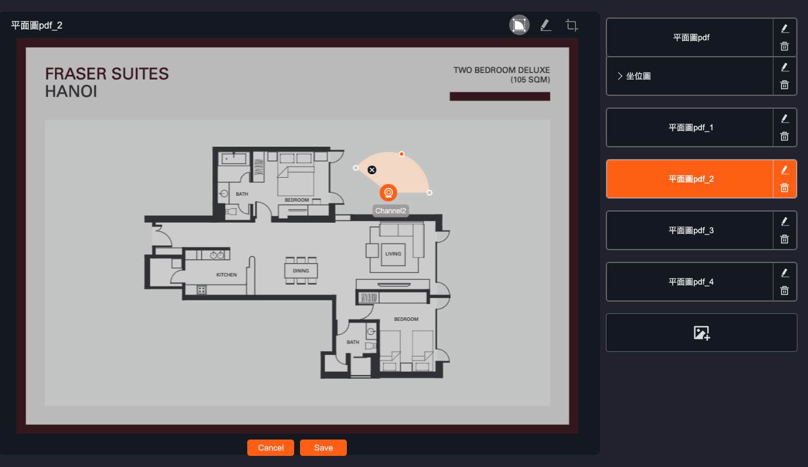

### 功能說明

| 功能 | 說明 |
|------|------|
| 平面圖管理 | 支援上傳多張平面圖，右側清單切換 |
| 攝影機標記 | 在平面圖上拖曳放置攝影機圖示 |
| 視角扇形 | 以扇形區域呈現攝影機可視範圍與覆蓋角度 |
| 即時編輯 | 拖曳控制點調整扇形方向、角度與半徑 |
| 儲存 / 取消 | 編輯結果即時儲存，支援取消復原 |

### 互動流程

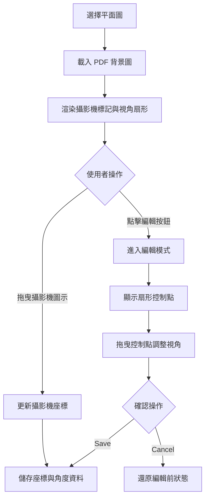

### 技術實作重點

- 使用 **Konva.js** 進行 Canvas 繪圖，管理攝影機圖示、扇形區域、控制點等圖層
- 扇形視角以**極座標計算**轉換為 Canvas Path，支援任意角度與半徑
- 拖曳控制點時即時重算扇形頂點座標，達到流暢的視覺回饋
- 攝影機座標系統以**相對比例**儲存（而非像素），確保在不同螢幕尺寸下正確還原位置

---

## 🔔 事件通知系統

VMS 系統整合三種通知管道，當設備偵測到事件時，依使用者訂閱設定即時推送通知。

### 支援通知類型

| 通知方式 | 說明 |
|----------|------|
| Web Push | 透過 Service Worker 推送瀏覽器原生通知 |
| LINE 通知 | 透過 LINE Messaging API 發送訊息 |
| Email 通知 | 發送電子郵件到使用者信箱 |

### 初始化與 Web Push 設定

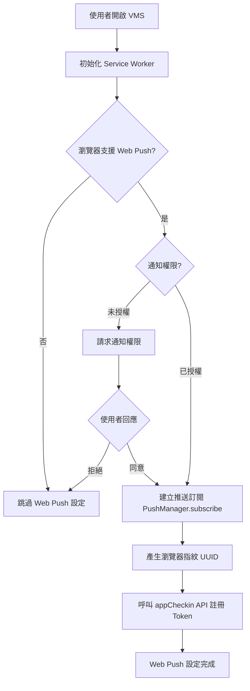

### 事件觸發與通知推送

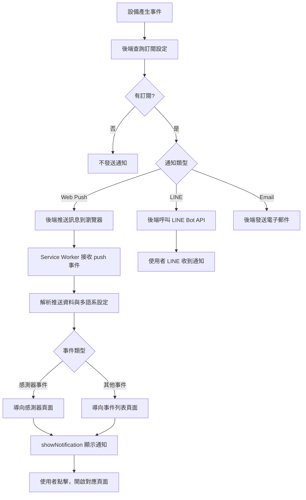

### LINE 通知授權流程

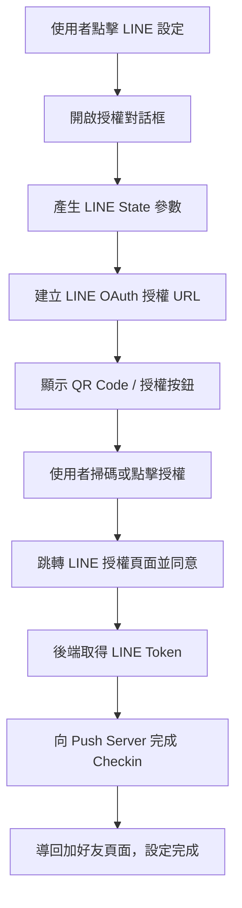

### 事件訂閱管理

使用者可針對每台設備選擇訂閱的事件類型與通知方式，支援批量快速設定。

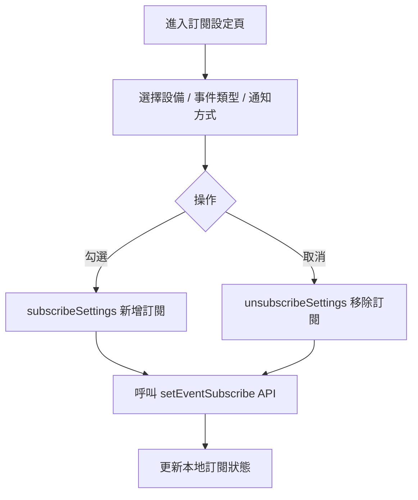

### 通知核心服務 `NotifyService`

| 方法 | 說明 |
|------|------|
| `subscribeSettings()` | 新增事件訂閱 |
| `unsubscribeSettings()` | 移除事件訂閱 |
| `getEventTypeSettings()` | 查詢訂閱狀態 |
| `quickSubscribeSettings()` | 批量設定處理 |

---

## 🛠 技術棧

| 類別 | 技術 |
|------|------|
| 前端框架 | React.js、Redux |
| 串流協議 | WebRTC、HLS (hls.js) |
| Canvas 繪圖 | Konva.js、Canvas API |
| 錄影 | RecordRTC、Canvas API |
| 動畫 | requestAnimationFrame |
| 縮放 / 拖曳 | CSS Transform、Mouse / Touch Event |
| 通知推播 | Web Push、Service Worker、LINE Messaging API |
| 樣式 | SCSS |

---

## ✨ 主要技術亮點

- **雙協議架構**：同一套元件支援 WebRTC 與 HLS 切換，透過 `connectType` 動態選擇播放器，擴充性強
- **Custom Hook 設計**：將播放、縮放、截圖、錄影各自封裝為獨立 Hook，職責分離，易於測試與維護
- **智慧閒置管理**：`useActiveMouse` 自動暫停長時間無操作的串流，有效節省網路資源
- **縮圖自動化**：`useCapture` 在 Live 模式下自動擷取並上傳縮圖，10 分鐘防重複上傳機制
- **Canvas 錄影**：支援將 video 畫面透過 Canvas 錄製輸出，解決部分瀏覽器無法直接錄製 HLS 的限制
- **平面圖編輯器**：使用 Konva.js 實作攝影機定位與扇形視角編輯，座標以相對比例儲存確保跨裝置一致性
- **多管道通知系統**：整合 Web Push（Service Worker）、LINE Messaging API、Email 三種通知管道，支援細粒度的設備 × 事件類型 × 通知方式訂閱管理